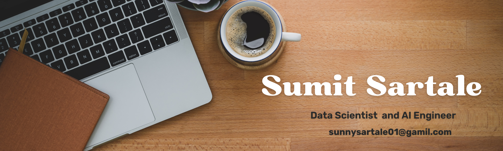

<!--Banner-->


<!-- Header -->
<div align="center">
  
</div>

<br/>

<!-- Intro -->
<div align="center">
  
</div>

<br/>

<p align="center">
  <a href="https://www.linkedin.com/in/sumit-sunil-sartale-469791232/" target="_blank">
    
  </a>
  <a href="https://github.com/sumitsartale40-ui" target="_blank">
    
  </a>
</p>

---

<!-- About Me -->
## 🙋‍♂️ About Me

```python
sumit = {
    "name"       : "Sumit Sunil Sartale",
    "role"       : ["Data Scientist", "AI Engineer"],
    "status"     : "Fresher | Open to Opportunities",
    "passion"    : ["LLMs", "Agentic AI", "ML Systems", "Data Science"],
    "learning"   : ["LangChain", "LangGraph", "CrewAI", "MLOps"],
    "goal"       : "Build intelligent, real-world AI-powered applications",
    "fun_fact"   : "Every day is a learning opportunity 🌱"
}
```

- 🤖 Passionate about **Agentic AI**, LLM systems, and building AI-powered applications
- 🧠 Deep interest in **Data Science**, ML model development, and AI research
- 🌱 Currently building skills in **LangGraph, CrewAI, AutoGen & MLOps**
- 💡 Exploring **Multi-Agent collaboration frameworks** and autonomous AI pipelines
- ✨ Student of life — always growing, always curious

---

<!-- Tech Stack -->
## 🧠 Data Science & AI Skills

<table>
  <tr>
    <td valign="top" width="50%">
      <h4>📊 Data Science</h4>
      
      
      
      
      
      
    </td>
    <td valign="top" width="50%">
      <h4>🤖 ML & Deep Learning</h4>
      
      
      
      
      
    </td>
  </tr>
  <tr>
    <td valign="top" width="50%">
      <h4>🔗 Agentic AI Frameworks</h4>
      
      
      
      
      
      
      
    </td>
    <td valign="top" width="50%">
      <h4>⚙️ AI Infra & Deployment</h4>
      
      
      
      
      
      
    </td>
  </tr>
</table>

---

<!-- GitHub Stats -->
## 📊 GitHub Stats

<div align="center">
  
  
</div>

<div align="center">
  
</div>

---

<!-- Currently Learning -->
## 📚 Currently Learning

- 🔗 Building advanced **Agentic AI** systems using LangGraph, CrewAI, and AutoGen
- 🔬 **LLM fine-tuning** and model alignment techniques
- ☁️ **MLOps** best practices and scalable AI infrastructure
- 🤝 **Multi-Agent collaboration frameworks** and autonomous AI pipelines
- 📦 **Vector Databases** — Pinecone, Chroma, FAISS for RAG systems

---

<!-- Connect -->
## 🤝 Connect With Me

<div align="center">
  <a href="https://www.linkedin.com/in/sumit-sunil-sartale-469791232/" target="_blank">
    
  </a>
  &nbsp;
  <a href="https://github.com/sumitsartale40-ui" target="_blank">
    
  </a>
</div>

<br/>

<!-- Footer -->
<div align="center">
  
</div>
